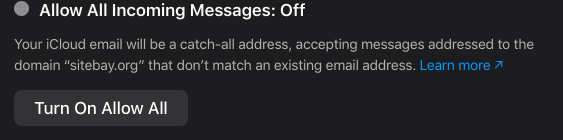
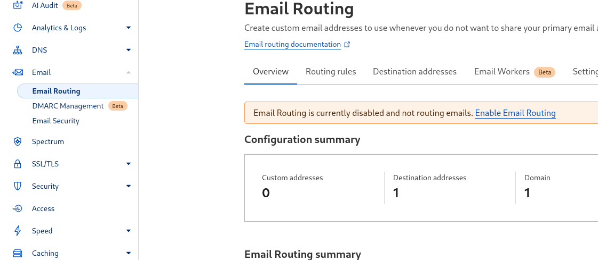
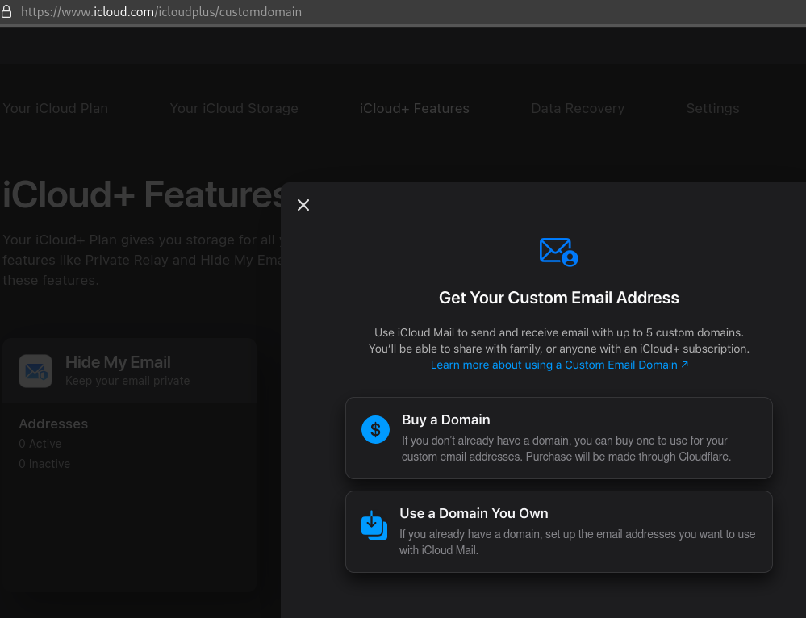
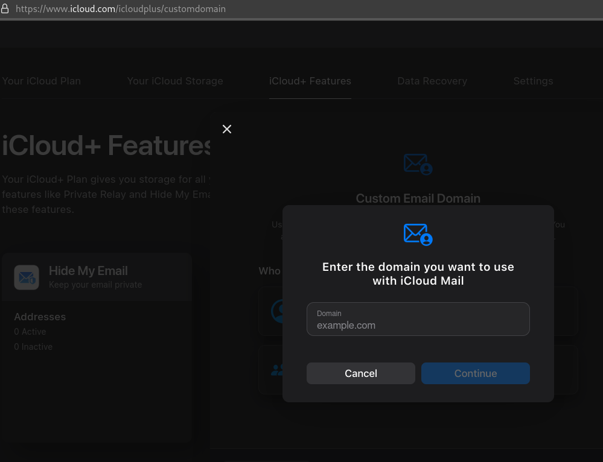
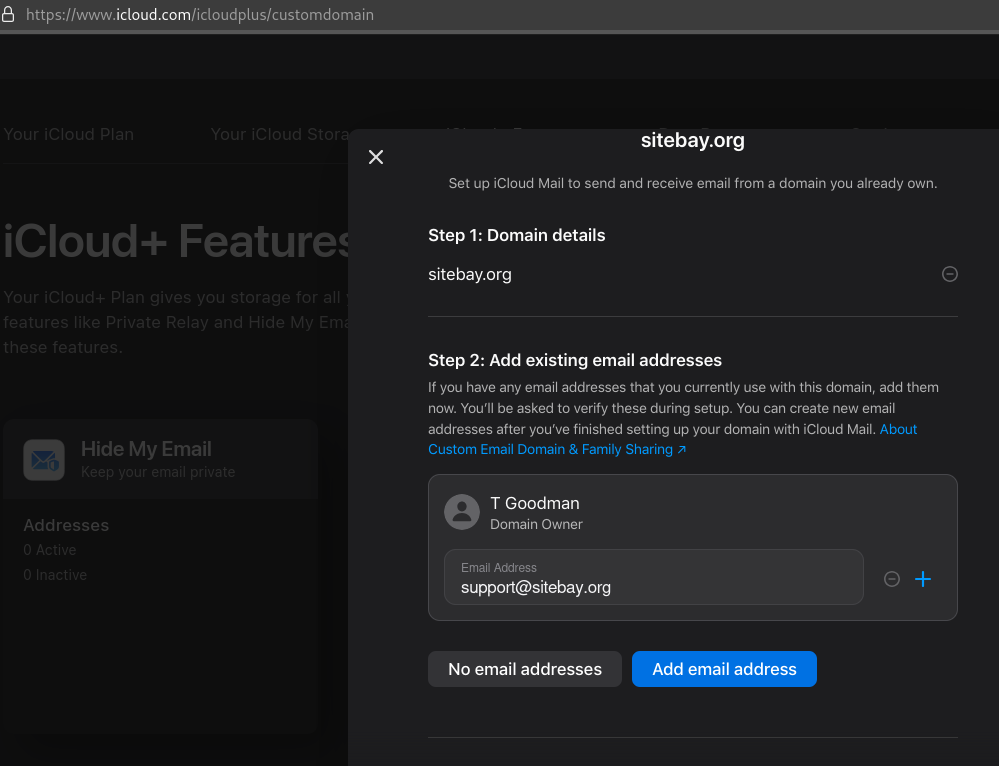

Cloudflare offers custom domain email setup with Gmail or iMail for custom emails. This guide on how to leverage SiteBay’s powerful hosting solutions alongside Cloudflare's DNS and security features to have a professional email using your own domain.
## The Setup Process
## Step 1: SiteBay Configuration

Initially, the focus will be on establishing your microsite using SiteBay’s intuitive platform. This includes selecting your desired domain, configuring your WordPress settings, and tailoring your site’s design and functionality to meet your specific needs. SiteBay facilitates easy site setup, ensuring your site is live and operational swiftly.
## Step 2: Cloudflare Integration

Once your site is configured, the next step entails integrating Cloudflare services. By pointing your domain’s DNS settings to Cloudflare, you gain access to their comprehensive suite of tools designed to enhance your site’s performance and security. This includes using Cloudflare's CDN for faster content delivery and utilizing their SSL certificates for enhanced website security.
## Step 3: Email Service Setup

The final piece of the puzzle involves setting up your custom domain email on Gmail or iMail. This is achieved by configuring specific DNS records in Cloudflare to redirect email traffic to your chosen email service provider. For Gmail users, this involves adding MX records pointing to Google’s mail servers. Similarly, iMail users will need to adjust their DNS settings accordingly.
For Non-SiteBay Users

If you're not using SiteBay for your website hosting, you can still integrate Cloudflare and your email service of choice by ensuring your website's DNS settings are appropriately configured in your hosting platform. The principle remains the same: leverage Cloudflare’s DNS management to route your domain's email traffic to Gmail or iMail, enabling a custom domain email setup.
For SiteBay Users

