### DISCLAIMER
This guide only details the methods I have been using for inpainting over the months and what is working for me. This guide is by no way meant to be extensive or 100% accurate. It merely offers the methods with which I’ve achieved success. There might be a better way to do things!

### NOTICE
This guide was written with Automatic1111 v1.7.0. Depending on versions, there might be slight variances in the UI. Everything described in this guide works for both SD 1.5 and SDXL.

Through the guide, I will use the same picture to illustrate the techniques:

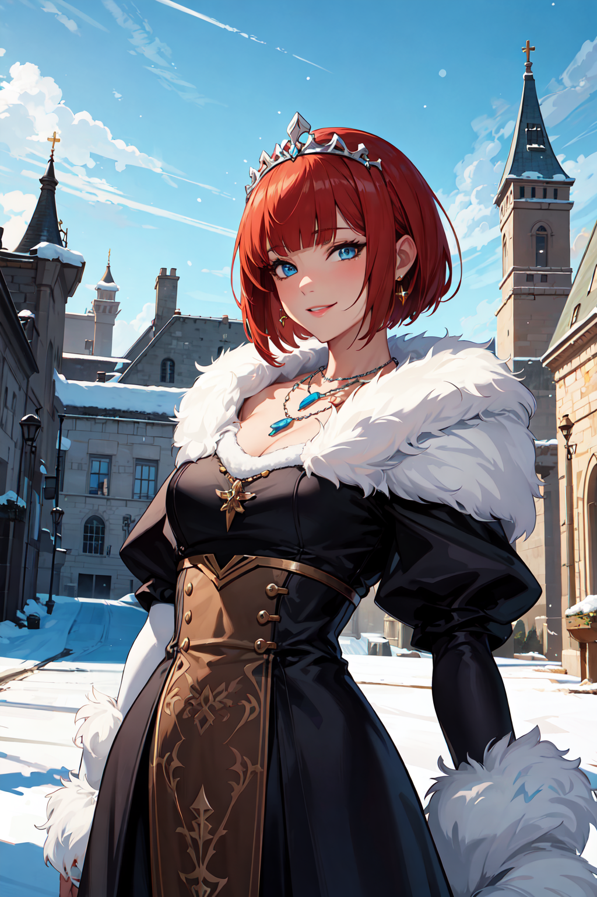

This picture was made at a 512x768 resolution with Hires.fix x2 using the following prompt:

```plaintext
(masterpiece, best quality, high quality, highres:1.4), detailed, extremely detailed, ambient soft lighting, 4K, 1girl, (mature female), (short hair, red hair, blunt bangs, (straight hair), long sidelocks:1.3), (blue eyes, smile:1.2), voluptuous, (black dress, white fur, fantasy, outdoor, shiny clothes, puffy sleeves, necklace, tiara, winter, castle, sky:1.3)

EasyNegative, (Low Quality, Worst Quality, Lowres:1.4), (Blurry, Blurry Background, Depth of Field, Bokeh, DOF, Fog, Bloom:1.4), (bad_prompt_version2:0.8), (frizzy hair, wavy hair, spiky hair, curly hair:1.4)
```

## 1. What’s Inpainting?

Inpainting is the process by which you will task the AI to modify (as slightly or as profoundly as you like) parts of an image to better suit your needs or correct mistakes. The basics of the process are as follows:

- Paint a mask (using the canvas tool within the UI) over the part you want to modify.
- Write a prompt for what you want to modify.
- Generate!

Inpaint is an incredibly powerful tool that will allow you to take your pictures to the next level. Correct hands, change hair or eye colors, swap character faces, increase detail levels, add elements and much more can be achieved through inpainting.

## 2. Basic Settings

The first thing you may have noticed when looking at the inpainting tab is that there are a lot of settings and none of them are explicit. Though in reality, once you know what each does, it’s fairly simple.

### Mask Blur
Honestly, I have no idea what this actually does (very bad start for a guide I know…) but I’ve always been fine with leaving it at its default value of 4.

### Mask Mode
A fairly simple setting:
- **Inpaint Masked** will modify what’s under the mask you’ve drawn.
- **Inpaint not Masked** will do the opposite. 99% of the time you will want to use **Inpaint Masked**.

### Masked Content
A more opaque setting. It’s basically how your inpaint will be generated.
- **Fill:** Will generate noise using the colors inside the mask. Will generate more drastic changes.
- **Original:** Will use what’s already under the mask. At lower denoising strength, will keep the nature of what’s in the mask almost intact. This is the mode I always use and the one I recommend.
- **Latent noise:** Will generate pure noise to work from scratch. This mode requires a very high level of denoising strength (0.85+), otherwise you will only see noise (gray pixel soup). Use this mode if you want to completely change the mask or add an element that isn’t there at all in the base picture. (For example, a coffee mug on a table)
- **Latent nothing:** Basically a worse Latent Noise, don’t use this.

### Inpaint Area
An important setting:
- **Whole Picture** will redraw the full picture using the resolution you set while inpainting the mask region.
- **Only Masked** will only redraw the mask region in the resolution you set, leaving everything else untouched, including the base resolution of your picture. This is the mode I always use and the guide will assume it is on at all times.

### Only masked padding, pixels
This setting is also very important. When inpainting using **Only Masked**, the AI will grab a certain amount of pixels around the mask you drew to get context. This slider determines how many pixels it takes. You can think of it as “how far does the AI look around to determine what it will produce”.

At 0, the AI will ONLY look at the mask and nothing else.
At 256, it will look at a fairly large amount of pixels around the mask. So, what do we set up on? When inpainting for details or for altering elements like clothes, jewelry, hair and such, keep as much padding as you can. When inpainting to profoundly modify an element or add an element, keep the padding low. The lower the padding, the more the AI will do its own thing.

Here’s an example:

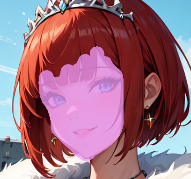 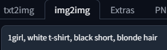
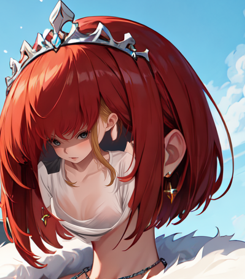
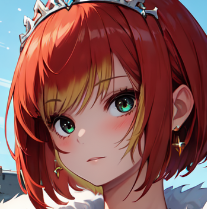

**Padding 0** vs **Padding 256**:
As you can see, at padding 0 the AI almost made a new image within the image, not caring for the coherency of the picture. While at padding 256, it kept a lot of coherency by just drawing a face, though we do get our blonde hair.

### Resize Mode
I honestly have no idea what all those do, I just keep it on **Just Resize**.

### Sampling Method, Sampling steps
Are similar to whenever you do a txt2img or an img2img. I’d recommend using the same setting as your base image. Euler a is overall good at inpainting and the sampler I’m always using.

### Resize to
Here you will need to input the resolution of your mask. I will talk about this more in depth later in the guide as it is fairly important.

### Batch count, batch size, CFG scale, seed
All the same as for txt2img and img2img.

### Denoising strength (DS)
Perhaps the single most important setting for inpaint. Basically, it determines how much noise will be poured into the mask before the inpaint process. The higher it goes, the more drastic the change.

- At 0, your picture will not change at all.
- At 1, it will be entirely different.

When inpainting for details, slight changes, or small corrections, I would advise keeping the DS between 0.15 to 0.45.

There is no “magic number” for DS. You may have to tweak it for every mask, depending on what you want to achieve and what results you get.

**Example of different denoising strengths:**
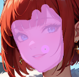 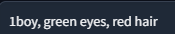 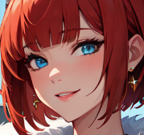 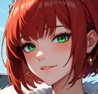

**DS 0.01** vs **DS 0.25** vs **DS 0.5** vs **DS 1.0**:
As you can see, the more DS you put, the more drastic the changes. At 1.0 the whole face perspective and posture completely changed too.

## 3. Checkpoints and VAE
As far as I know, any checkpoint can do Inpaint. Just as with any txt2img or img2img, both your selected Checkpoint and VAE will influence the style and colors of your inpaint outputs as well as how your prompts will be parsed. You are not required to keep the same checkpoint from the base image. Though, of course, if you want to keep the style consistent, use the base checkpoint. But you can very well use one checkpoint to make a base image and use another to inpaint the face for example. Mix and match to your heart's desire!

VAE comes down to personal preferences as always, BUT it is my experience that some VAE are better at inpainting than others. If you start seeing discolorations and artifacts around the edges of your masks, try another VAE.

## 4. The Canvas
This is the canvas. To start inpainting an image, start by dragging and dropping it inside the window or click on it to browse your folders. Once your image is loaded, clicking and dragging the mouse will start drawing the mask.

On the top right corner of the canvas you will notice a few buttons.

**From left to right:**
- **Cancel**: Cancel your last stroke.
- **Erase**: Erase the whole mask. Be careful.
- **Remove**: Remove the current picture.

**Top to bottom:**
- **Brush size slider**: Set the size of the brush.
- **Color picker**: Change the color of the mask. Has no repercussions on the inpaint process; just choose which color you prefer/which color makes it easier for you (you’ll notice mine is a light pink instead of the basic white).

### A°) What to Mask
There is no right or wrong way to mask. I personally prefer inpainting “part by part”, so for a face, for example, I would first mask the hair, inpaint it, then mask the face, inpaint that, and if there are accessories, mask them separately.

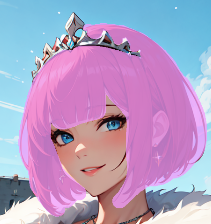 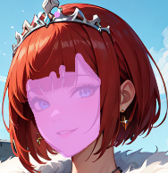 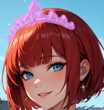

**Breakdown of how I inpaint the face in three distinct steps.**
Though this process takes more time, it allows me greater control over each individual part. You could very well inpaint the whole face (hair + face + tiara) and do it all in a single prompt, which is totally valid too.

Your mask doesn’t need to be perfect. It doesn’t matter if you go a little overboard. Do try to keep it as close as possible to the bounds of your subject though.

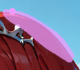

**Though the mask bites slightly into the sky, it will not turn the blue into red hair when I inpaint.**

### B°) Mask Resolution
As we saw previously in the setting, you need to set a resolution for your mask (Resize to). This setting is very important as it will heavily influence the quality of your inpaint output. Basically, the higher you can go, the greater the details you will get. Though there are caveats to this rule (we will come back to it).
 
Unfortunately, this is heavily tied to your hardware. Just as for a txt2img, the higher mask resolution you will be able to achieve will depend on your gear. Higher resolutions mean more VRAM capacity and longer generation times. You will need to find the happy middle for your setup. 

It is also important to consider the shape of your mask when deciding on resolution. The rule of thumb would be: try to respect the aspect ratio of your mask. 

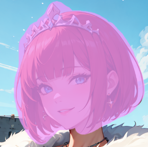 **A square resolution would suit this mask**

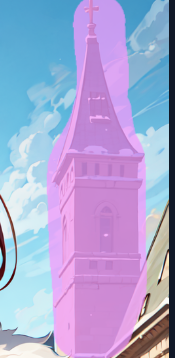 **A portrait resolution would suit this mask (height > width)**

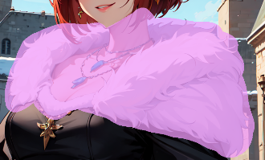 **A landscape resolution would suit this mask (width > height)**

Depending on your checkpoint preferences, you could very well use a portrait resolution even for a square-shaped mask. 

A last thing to note regarding the resolution is the resolution of your base image. The bigger your base image, the greater the details you’ll achieve, up to a certain threshold. But bigger base images will also need more VRAM and will increase generation time too.

To illustrate, here is our base example being parsed through 5 different mask resolutions for 3 different base resolutions. All examples use the same mask, same seed, and a denoising strength of 0.45 with the following prompt:

**(masterpiece, best quality, high quality, highres:1.4), detailed, extremely detailed, perfect face, perfect eyes, (mature female:1.2), blue eyes, (freckles:1.1), (smile), perfect mouth, perfect lips, (thick eyelashes, long eyelashes, red lips), red hair, blunt bangs**
**EasyNegative, (Low Quality, Worst Quality, Lowres:1.4), (Blurry, Blurry Background, Depth of Field, Bokeh, DOF, Fog, Bloom:1.4), (bad_prompt_version2:0.8)**

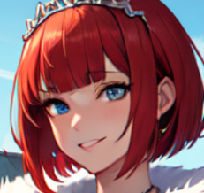 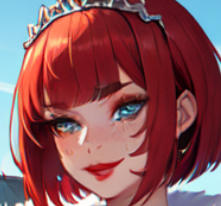 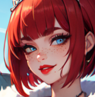

**Base image (512x768)          512x512          1024x1024**

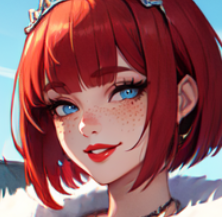 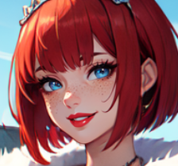 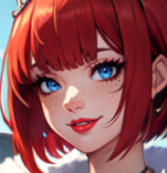

**1024x1536          1536x1536          2048x2048**

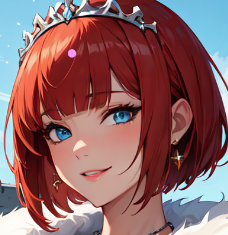 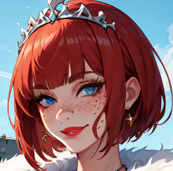 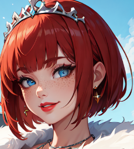

**Base image + hires. fix x2 (1024x1536)          1024x1024          2048x2048**

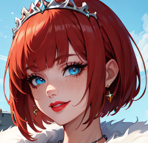 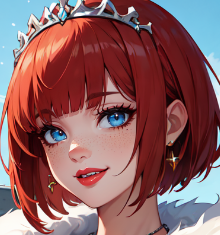 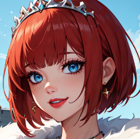

**1024x1536          1536x1536          2048x2048**

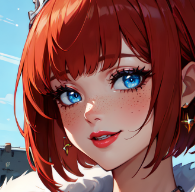 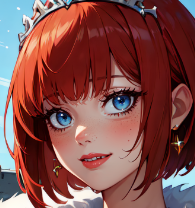 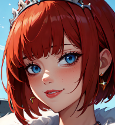

**Hires. fix + Extra x2 (2048x3072)          1024x1024          2048x2048**

Circling down to the caveats mentioned at the start of this part, higher resolution doesn’t always mean better. As you can see in the last two examples, past a certain threshold of resolution you will start to see weird behaviors, uncanny valley faces, warped textures and the like just as you would in a txt2img if you go too high. 

Those thresholds are very checkpoints dependent, some will behave better than others. Depending on your base resolution, at a certain point you also get diminishing returns to details and quality.

## 5. Prompting
Prompting for Inpaint is nothing different than prompting for txt2img. The only real difference is, you’re not describing a whole picture, but part of it. This is the template I use for every inpaint prompt:

QUALITY/MANDATORY KEYWORDS (ie. “masterpiece, best quality”) + 
DESCRIPTION OF THE MASK (and only what’s in the mask) +
LORAS

A few examples:
**(masterpiece, best quality, high quality, highres:1.4), detailed, extremely detailed, perfect face, perfect eyes, (mature female:1.2), blue eyes, (freckles:1.1), (smile), perfect mouth, perfect lips, (thick eyelashes, long eyelashes, red lips), red hair, blunt bangs**

**(masterpiece, best quality, high quality, highres:1.4), detailed, extremely detailed, black jacket, gold button, silk, shiny clothes**

**(masterpiece, best quality, high quality, highres:1.4), detailed, extremely detailed, window, white curtain, see-through, trees, sky < lora:add_detail:1>**

As for the negative prompt, simply use your standard negative prompt. You might need to add to the negative elements that can appear a lot more in inpaints than in txt2img. For example, my model really likes earrings for some reason and whenever I inpaint an ear, it adds earrings to them, unless I add (earrings:1.4) in the negative prompt.

## 6. Advanced Tips and Tricks
Everything we covered so far will be enough to get you started on your inpaint journey. What follows are more advanced tricks to go the extra mile.

### A°) Manual Edits
Using a photo editor/drawing software before your inpaints can save you loads of time and headache. The more you help the AI achieve what you want, the faster and the less painful the process will be. It can range from removing errors like extra fingers, to manually changing a color to add an element before inpainting it.

Let’s take an example. We want our subject to have black hair. So we start by masking her hair:

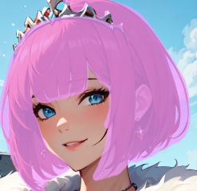

We write the prompt:


And we generate (denoising 0.45):

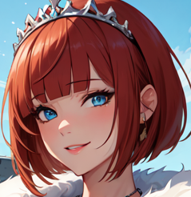

Big sadge, it didn’t really work (or at all). The reason is, red is too far away from black to be changed at such a denoising strength. That’s when we can help the AI.

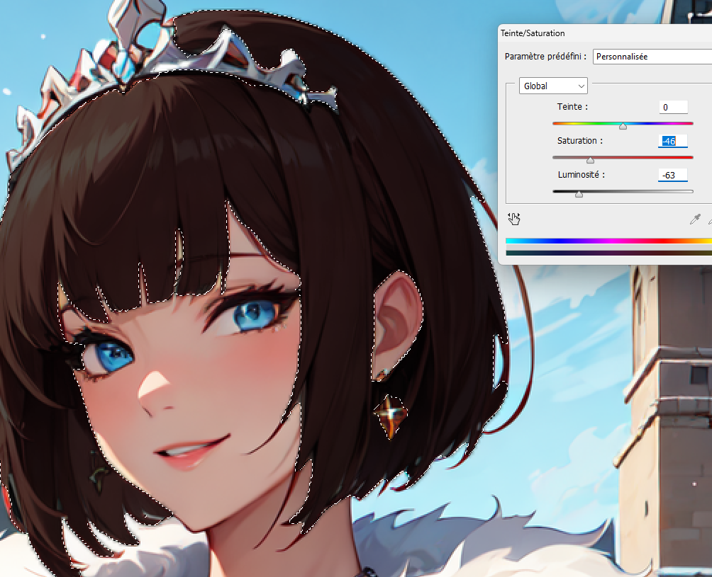

In photoshop, we select the hair and reduce both saturation and light. We save the new result and load it on the canvas then generate again, same prompt, same DS, same seed.

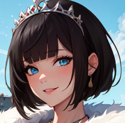

Much better!

### B°) Drawing and Inpaint Sketch
Another way to help the AI is to draw what you want on the picture. It doesn’t have to be perfect, just enough to give the AI a sense of what you want. 

Here’s an example. We want to give our subject some fashionable glasses. So we start by loosely drawing them in photoshop only using the pen tool:

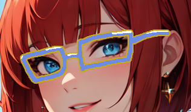

We load it on the canvas and mask the glasses:

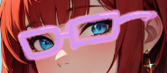 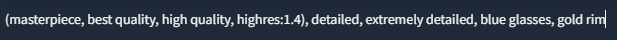

And voilà:

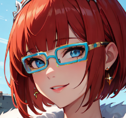

Of course, the more detailed your sketch, the easier it will be for the AI to make a good result.

If you don’t have access to a drawing app, you can use Inpaint Sketch within A1111. It’s the same as a regular inpaint the difference being that the AI will use the form and colors of your mask to generate what you prompted for. So using Inpaint Sketch, I redraw the glasses directly on the canvas:

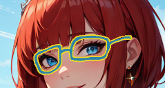

Then using the same prompt:

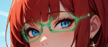

As you can see, the result isn’t as good, so I would always advise to draw on a dedicated app and then inpaint your drawings normally, but in a bind, Inpaint Sketch could help you.

### C°) Collage
Inpaint can also be used to help you blend external elements into your image.

Let’s start with an example right away. Let’s add a plane into our base image:

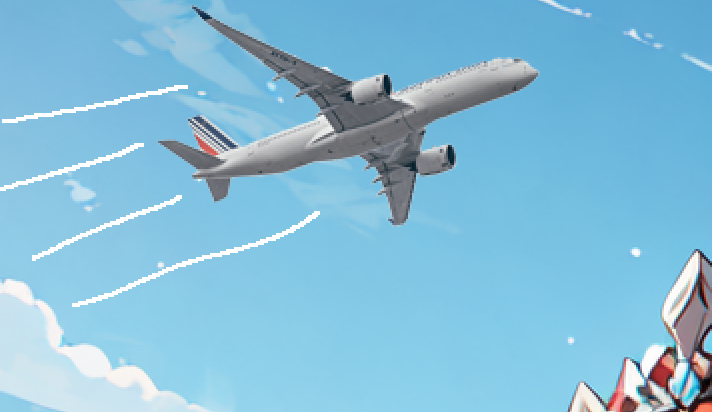

I just copy/pasted a real photo of a plane,

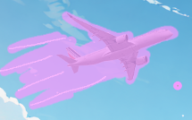

## Applying the Inpainting

Using advanced AI techniques at a denoising strength of 0.35, transformations were made to the initial image. This step incorporated a blend of AI-driven creativity and manual adjustments to achieve a desired artistic effect.


## Final Result

The results of the inpainting are impressive. The image retains the essence of the original but introduces new artistic elements that make it unique and visually appealing.

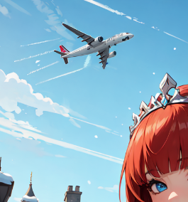

## Closing Thoughts

While inpainting offers enormous potential, it's important to remember that it remains a tool assisted by AI. Success in this field requires patience, experimentation, and a deep understanding of both the technology and artistic vision.

Inpainting isn't just a tool but a new frontier in digital creativity. And as the technology matures, it will become an indispensable part of digital artists' toolkit.

Here’s an enhanced version of the detailed steps and techniques used in this guide:


After applying various techniques mentioned:


