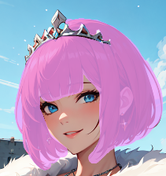

This guide adapts RoiD1kan's original AUTOMATIC1111 workflow. The original examples were made with WebUI 1.7.0; they illustrate a method, not current-version benchmarks or guaranteed settings.

## Keep a reproducible starting point

Save the original image, model, VAE, seed, prompt, and generation settings. Use an image and model you are permitted to use. Work on one part at a time so a later change does not erase an accepted result.

The original case study used this image:

## 1. Select the region

Load the image in the inpainting workspace and paint a mask over the target. Check the mask mode before generation. The original workflow used **Only masked** to focus the operation on a selected region.

For a complex subject, split the work into parts such as hair, face, and accessories. A small, well-chosen mask makes it easier to see which change produced the result.

## 2. Include useful context

Padding provides context around the mask. Too little context can make the generated region inconsistent with the surrounding image. More context can help preserve composition, but it can also constrain the requested change.

The original guide compared low and high padding on the same target. Treat those comparisons as examples rather than adopting their pixel values for every resolution.

## 3. Match the working resolution

Choose a resolution and aspect ratio appropriate for the region and model. A narrow mask and a square processing area can produce different results. Increasing resolution can increase memory use without fixing a poorly chosen mask or prompt.

Change one dimension or setting at a time and compare the full image, not only the edited crop.

## 4. Adjust change strength

Denoising controls how strongly the model can depart from the input. The original guide used lower values for small corrections and higher values for replacement, while noting that no single value works for every edit.

Start with a bounded comparison using the same seed. Check whether details were preserved, whether the requested change appeared, and whether edges remain coherent. Increase the strength only when the result justifies it.

## 5. Save and continue

Save an accepted intermediate image before masking the next region. Keep the prompt and settings with it. If an edit introduces unwanted changes, return to the prior image instead of repeatedly processing a degraded result.

For visible seams, review [soft inpainting](). The current software and model documentation take precedence over the original guide's personal sampler or VAE preferences.
