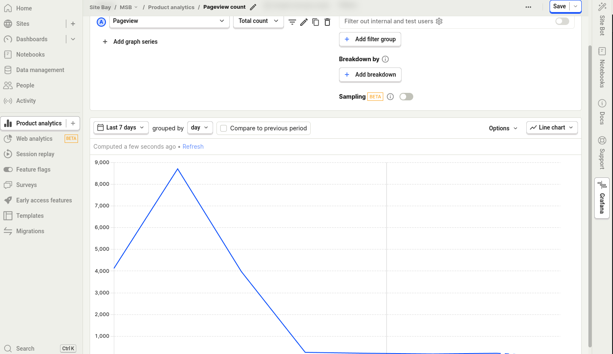
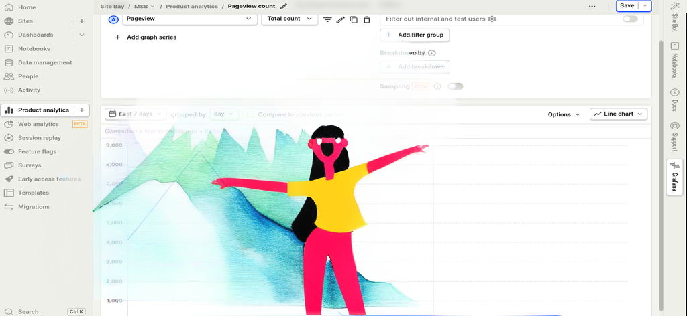
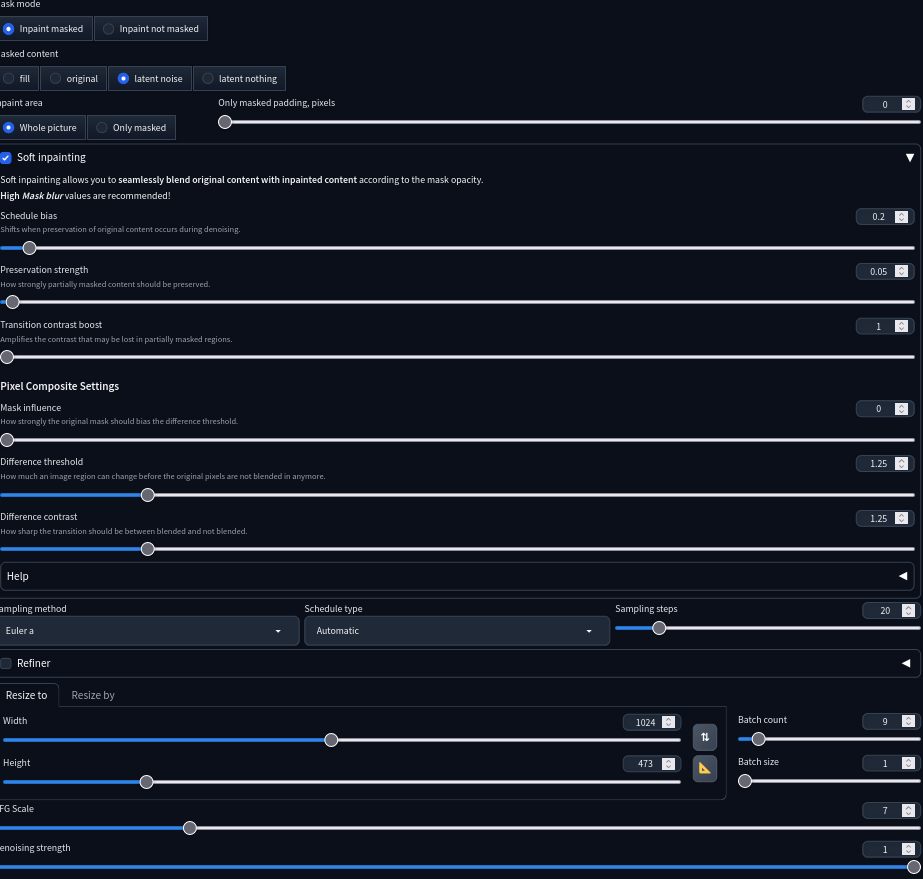
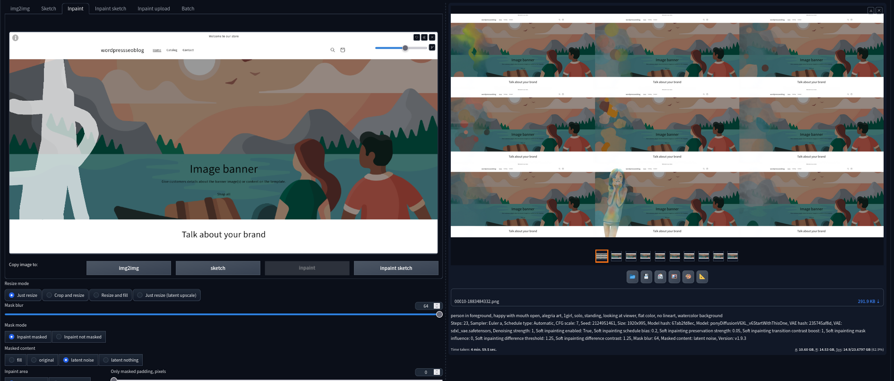

Soft Inpainting Guide: How We Make our Tutorial Images
So if there's a visible division between the inpainted area and the rest of your image using normal inpainting, we can fix this with the new Soft inpainting feature.

Soft inpainting enables you to introduce new elements to your image that blend effortlessly with the original.
- Before

- After

Activate Soft Inpainting by checking the checkbox next to it.

### Software
Use AUTOMATIC1111, https://github.com/AUTOMATIC1111/stable-diffusion-webui

A simple example of soft inpainting
Create Your Background Image
Start off by producing a background image. Within AUTOMATIC1111, head to the txt2img link and provide the image settings.

### Model
https://civitai.com/models/349146/alegria-artcorporate-memphis

### Settings
I want to turn the graph into a mountain and have an alegria art (corporate memphis) girl on it.
We will use the prompt:
    happy with mouth open, girl on mountain, alegria art, 1girl, solo, standing, looking at viewer, flat color, no lineart, watercolor background

It will generate new content on your original image and interact and add onto the original content. Very neato. With the brush tool, **draw a squiggle where you want the character to be**. I made a small squiggle on the bottom of the image. The model will not be limited to the drawn area, but it'll tend to gravitate towards it. It's basically the center of mass of where the AI model will generate.

It kind of blotches the background but that's why we add watercolor background to the prompt to make it look intentional.

Remember to click the protractor icon (right angle triangle) to automatically set the image dimensions, otherwise your resultant image will be stretched.

Most of the images are not very good, so it's best to just generate a bunch and cherry-pick the best one. Set the batch to 9.
Keep clicking on Generate until you get a nice one.

With soft inpainting, “Only masked padding, pixels” should be zero. Because the Mask blur needs to be set to max.

Click on “Generate”. Then see that even with high denoising, it's still perfectly blended in. 

### How Soft Inpainting Works
Soft inpainting employs a smooth (grayscale) mask that ensures a smooth transition from the masked to the unmasked region vs standard inpainting which uses a binary black-or-white mask.

In the transition area where the mask is gray, the latent images of the inpainted and the original content blend in order to create a seamless transition.

You can control this by adjusting the software settings.

## Soft Inpainting Settings

- Mask blur: 64 (max)
- Masked Content: Latent noise
- Sampling technique: Euler a
- Sampling Steps: 20
- Denoising strength: 1 (full)
- CFG scale: 7
- Area of Inpaint: Entire Image
- Schedule Bias: 0.2
- Preservation Strength: 0.05
- Transition Contrast Boost: 1 (minimum)
- Difference Threshold: 1.25
- Difference Contrast: 1.25
- Sampling Method: Euler a
- Resize to Height and Width: Click the yellow triangle
- Denoising strength: 1

### Schedule Bias
Schedule bias adjusts the preservation level of the original content at each stage. Higher values will show the original visual more. Basically it will try not to perturb the original image as much. **0.2 worked for us**, but you can raise it a bit.

### Preservation Strength
The preservation strength controls the amount of original content preserved. A high preservation strength will leave more of the original content. The same as Schedule bias but less sensitive.

### Transition Contrast Boost
The transition contrast boost controls how abruptly the original and inpainted contents blend. 

### Mask Influence
Mask Influence controls the level of influence the inpaint mask has over the process.
**I don't think this makes a difference.**

### Difference Threshold
The difference threshold controls the allowed amount of change without showing the inpainted content.
**1.25 is perfect for our use-case**, anything higher will fade the inpainted content.

### Difference Contrast
The difference contrast controls the abruptness of the transition between original and new contents. Higher values will create a fade-out effect. The same effect can be created by manipulating the difference threshold.
**1.25 is perfect for our use-case**, anything LOWER will fade the inpainted content.

## Closing thoughts
- Use the brush where you want your generated content to appear
- Most of the generated images are not very good but about 10% are cool so just keep making more. There was only one where it generated the character i specified: in the bottom center out of a batch of 9.

