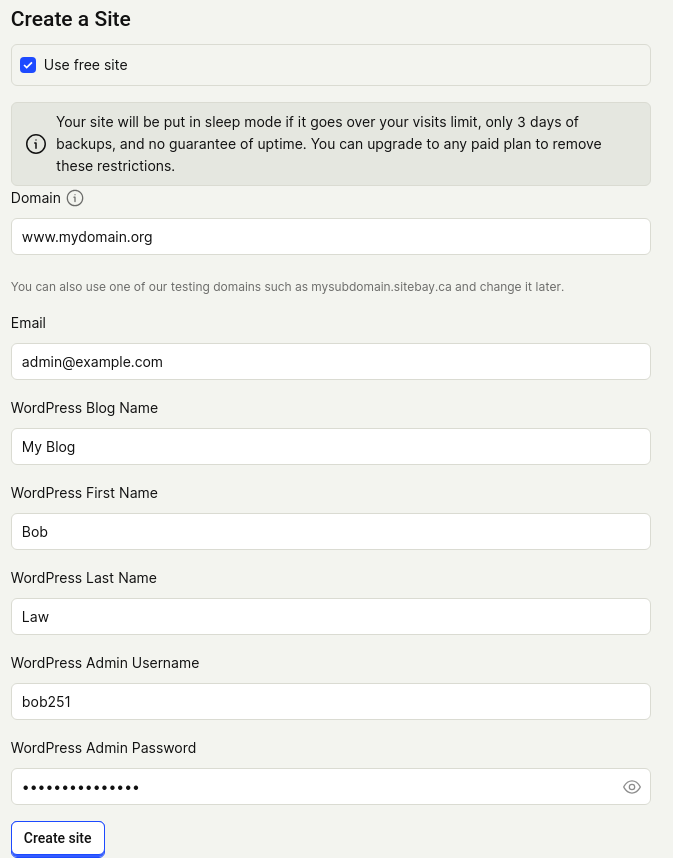

## Set Sail with Site Bay!

Let's get started with Site Bay, Powerful WordPress Hosting! This tutorial will help you sign up for an account on [My Site Bay](https://my.sitebay.org), our browser-based control panel where you can create, manage, and monitor your WordPress sites with the scalability of Kubernetes.


On your phone? Our Getting Started Mobile Tutorial is perfect for on-the-go setup.


## Let's Get Started
1. First time with us? Sign up. It's super quick.
1. Choose Your Plan: Get started with the free plan. Upgrade your plan from $19/month. 

## Setting Up Your WordPress Site
1. Log In: Head over to My SiteBay and log in with your details. GitHub fans, we've got a direct connect for you too.
1. Select a Location: EU User? Choose your data center location in user settings to ensure fast loading times for your audience. By default it will be set to Washington.
1. Create Your Site: Find "Create Site" on the sidebar and click it to begin.

1. DNS Setup: Go to your domain registrar and point a CNAME record to washington.cname.sitebay.org or frankfurt.cname.sitebay.org for EU users.


Testing things out? Use one of our test subdomains.

1. Launch Time: Punch in your CNAME set up domain name, name your blog, set WordPress login details, and launch.


WordPress devs, take your site to the next level with our Bi-directional Git Sync feature.


Hang tight for about a minute while we prepare your site.

What’s Next?

Your site is just the starting line. Explore our guides for viewing recordings, analytics, setting up and using Git Sync, and unlocking features to make your site pop.

Excited to have you on board! We're looking forward to seeing what you'll build.