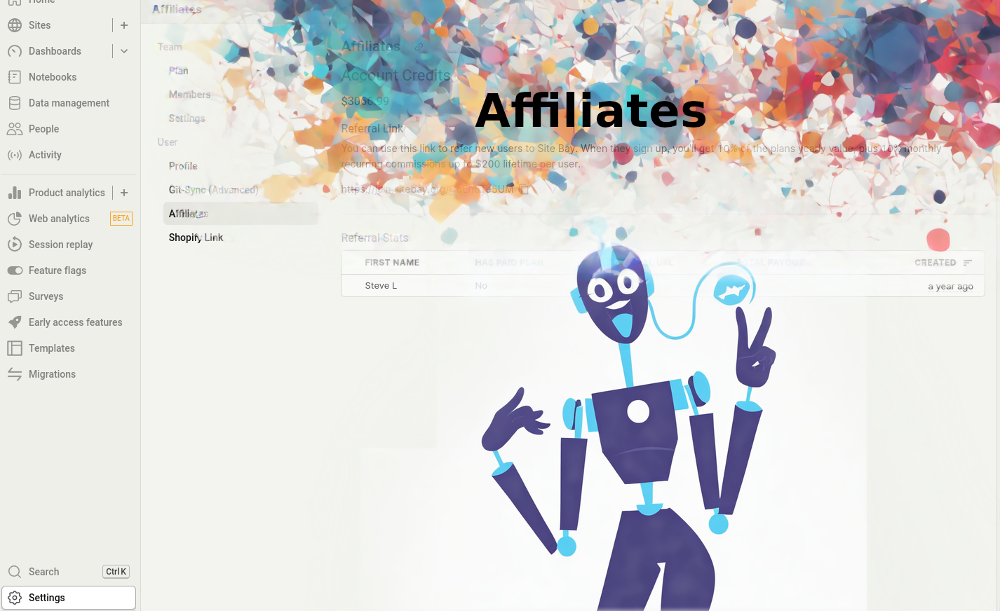

Welcome to SiteBay's Affiliate Program! If you're all about WordPress hosting on Kubernetes and love the idea of earning some extra cash, you're in the right spot. This program is designed for folks who are excited to share the awesomeness of SiteBay with their network. Whether you're a blogger, a social media influencer, or just someone with a lot of friends interested in web hosting, you can start earning today.

## What is SiteBay's Affiliate Program?

SiteBay's Affiliate Program rewards you for referring new users to our platform. For every person you refer who signs up and subscribes to one of our plans, you'll receive recurring credits towards your SiteBay services. It's our way of saying thanks for spreading the word.

## How Does It Work?
1. Sign Up: First things first, you'll need to join the program. It's quick and easy. Just head to your My SiteBay dashboard and look for the Affiliate section in your settings page.
1. Share Your Link: Once you're in, you'll get a unique referral link. Share this link with your friends, followers, or anyone you think would benefit from SiteBay's services.
1. Earn Credits: For every new user that signs up through your link and subscribes to a paid plan, you'll earn credits. These credits can be used towards your own SiteBay services, making it a win-win.

## Why Join?
1. It's Profitable: You get a recurring 10% cut from every successful referral. The more you refer, the more you earn.
1. Boost Your Site: Use your earnings to enhance your own SiteBay hosting plan or try out new features without spending extra.
1. Support Your Network: By referring your friends to SiteBay, you're helping them find a robust and scalable WordPress hosting solution.

## Tips for Success
Share Your Experience: People trust personal experiences. Share how SiteBay has helped you or your business with WordPress hosting.
Utilize Social Media: Leverage your social media platforms to reach a wider audience. Regular posts, stories, or tweets about SiteBay can increase your referrals.
Create Content: Blog posts, videos, or tutorials about using SiteBay can attract viewers and potential referrals.
Getting Started

Ready to jump in? Head over to your SiteBay dashboard, find the Affiliate Program section, and start sharing your unique link. It's that simple.