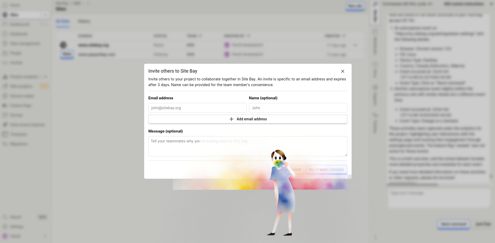


All team members have equal privileges and can create or modify any resources including sites on the team.


In the realm of WordPress hosting, collaboration is key to managing and scaling your projects effectively. Site Bay introduces a groundbreaking way for team members to work together on your WordPress sites, simplifying the process and enhancing productivity. Whether you're managing a single site or overseeing a multitude of WordPress projects, Site Bay's collaborative features are designed to streamline your workflow and make team management a breeze.

# Why Collaborate on Site Bay?

Collaboration on Site Bay means bringing together your developers, designers, content creators, and project managers in a unified platform where communication, task allocation, and project tracking are simplified. Here are some reasons why team collaboration on Site Bay is beneficial for your WordPress projects:

## Centralized Management

Manage all your WordPress sites from a single dashboard. Assign roles, set permissions, and monitor progress without having to juggle multiple tools or platforms.

## Real-time Communication

Stay in sync with your team members through integrated communication tools. Whether you're discussing a new feature, troubleshooting an issue, or planning your content strategy, effective communication is just a click away.

## Streamlined Workflow

With Site Bay, you can streamline your project workflows by setting up task lists, deadlines, and milestones. Keep everyone on track and ensure that your projects are moving forward efficiently.

## Access Control

Grant access to your WordPress sites based on roles and responsibilities. From developers needing full access to your site's backend to content creators who only need to publish posts, customize access to suit your team's needs.

## Seamless Collaboration

Share files, documents, and resources directly within Site Bay. No more scattered emails or lost files. Everything your team needs is centrally located and easily accessible.

# Getting Started with Team Collaboration on Site Bay

Inviting your team to collaborate on Site Bay is straightforward:

1. Create Your Site Bay Account: If you haven't already, sign up for Site Bay and set up your WordPress site.

1. Invite Your Team: Navigate to the Settings section in your Site Bay dashboard. Here, you can invite team members by entering their email addresses.

1. Set Up Projects: Organize your WordPress sites into projects. Assign team members to specific projects, setting clear roles and permissions.

1. Collaborate and Manage: Use the dashboard to manage projects, communicate with team members, and monitor progress. Customize the workflow to match your team's specific needs.