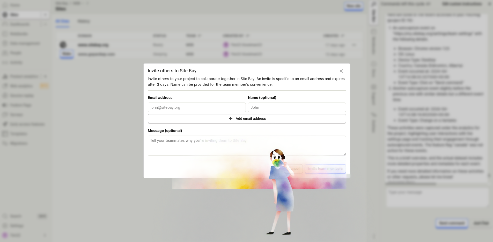


All team members have equal privileges. They can create/modify all resources.


# Team Members

Invite others to manage your SiteBay sites.

## Add Member

1. **Settings > Team**
2. Enter email address
3. Click **Invite**

## Permissions

All members can:
- Create/delete sites
- Access all sites
- View analytics
- Manage billing

## Remove Member

1. **Settings > Team**
2. Find member
3. Click **Remove**
