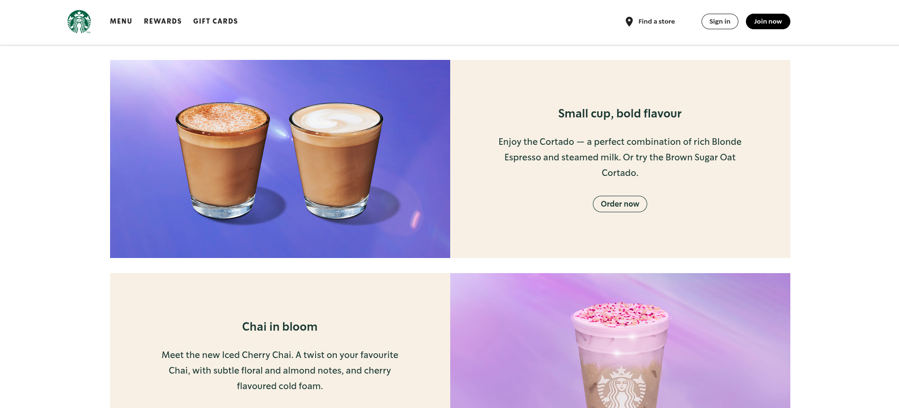
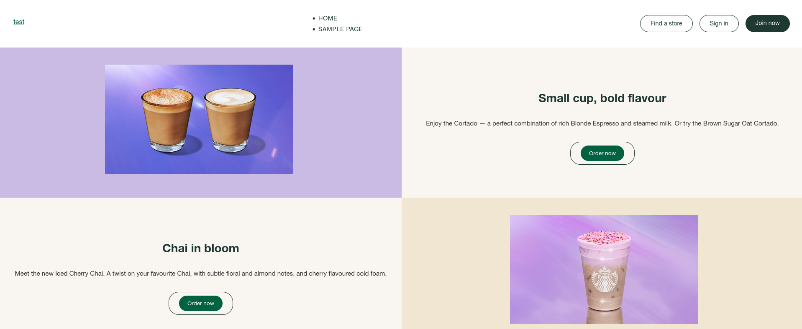

We used Claude 3.7 as our model, asking it to create a WordPress site from the following image

And this was the result

## Protips
- Ask Roo to start with the top part (header) and work its way down
- Including the purified css may help
- Describe the javascript to roo, if any

Ever stared at a cool website design and thought, "Man, I wish I could just snap my fingers and make my site look like that?" Well, with Cline/Roo Code and SiteBot, you're pretty much there. This AI combo is like having a design team on speed dial, ready to turn pictures into live websites with just a few prompts.

## What's the Magic Behind It?

Picture this: You've got a mockup, a screenshot, or even just a rough sketch of your dream website. Instead of spending hours coding HTML, CSS, and wrestling with responsive designs, you just show it to an AI assistant and say, "Make me this." That's the power of Cline/Roo with SiteBot integration.

Here's what makes this tech combo a game-changer:
- **Visual Understanding**: The AI analyzes your image and identifies UI elements, layout structure, and design aesthetics.
- **Code Generation**: It converts visual elements into clean, functional code.
- **WordPress Integration**: With SiteBot, changes can be made directly to your WordPress site without manual copying and pasting.

## Step-by-Step: From Image to Live Website

Ready to transform that design image into a real website? Here's how:

1. **Fire Up Cline/Roo Code**: Open up your Cline/Roo interface (desktop app or web version).

2. **Connect SiteBot**: Make sure your SiteBot is connected to your WordPress site. This gives the AI direct access to modify your site.

3. **Share Your Design Image**: Upload or drag and drop your website design image. The clearer the image, the better the results.

4. **Give Context**: Tell the AI what you're trying to achieve. Something like: "Create a WordPress site that looks like this image" or "Redesign my homepage to match this mockup."

5. **Let the AI Work**: Watch as it analyzes your image and starts generating the necessary HTML and CSS. It's like watching a digital artist sketch out your vision in real-time.

6. **Review the Draft**: The AI will create about 90% of what you need, typically missing some fine details like specific margins and padding in the CSS.

7. **Make Refinements**: Be specific about what needs tweaking. For example: "The spacing between these sections needs to be larger" or "The header text should be more prominent."

8. **Finalize and Deploy**: Once you're happy with the design, the AI can push these changes directly to your WordPress site via SiteBot.

## The Last Mile: Tweaking for Perfection

While the AI gets you 90% there, that last 10% often comes down to fine-tuning the spacing and layout. Here are some common adjustments you might need to make:

- **Margin Adjustments**: "Add 20px margin to the top of the hero section."
- **Padding Refinements**: "Increase padding in the content cards to 15px all around."
- **Responsive Fixes**: "Make sure the design adapts well on mobile screens."
- **Font Size Tweaks**: "The paragraph text should be 16px, not 14px."

The beauty is you don't need to know CSS to make these requests—just describe what you want in plain English.

## Why This Approach Rocks

Creating websites this way isn't just cool—it's practical:

- **Speed**: Turn around designs in minutes instead of days.
- **No Coding Required**: Perfect for non-developers who have a clear visual idea.
- **Iteration is Easy**: Don't like something? Just ask for changes conversationally.
- **Learning Opportunity**: Watch how the AI structures HTML and CSS—it's like having a coding mentor.

Next time you find yourself inspired by a killer website design, don't just bookmark it for "someday"—grab a screenshot and let Cline/Roo with SiteBot turn that inspiration into your own site reality. It's web development for the AI age, and it's changing how we build on the web.