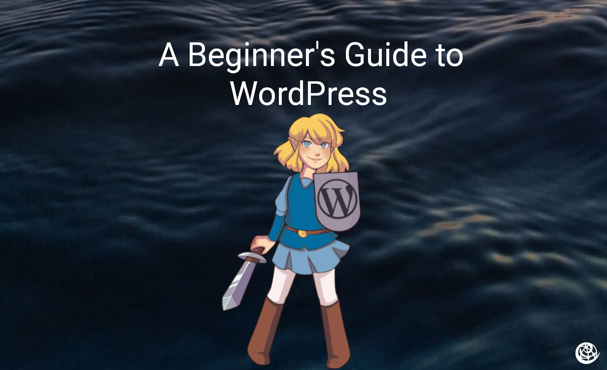

Advanced WordPress customization beyond posts and pages.

## Custom Post Types

Create unique content structures beyond Posts/Pages.

**Use cases:**
- Recipes (ingredients, cook time, difficulty)
- Products (price, SKU, inventory)
- Events (date, location, tickets)

**Options:**
- Plugin: Custom Post Type UI
- Code: `register_post_type()` function

## Custom Fields

Add extra data to posts/pages.

**Use cases:**
- Author bio
- Product pricing
- Event details

**Recommended:** Advanced Custom Fields (ACF) plugin

## Custom Taxonomies

Create custom classification systems beyond categories/tags.

**Example:** Movie site with "Genres" taxonomy

## Performance Optimization

### Caching
- WP Super Cache
- W3 Total Cache

### Images
- Compress with WP Smush or ShortPixel
- Use appropriate sizes

### Plugins
- Fewer = faster
- Remove unused plugins
- Regular updates

## Security

| Action | Purpose |
|--------|---------|
| Keep updated | Patch vulnerabilities |
| Strong passwords | Prevent brute force |
| Limit users | Reduce attack surface |
| Wordfence | Active protection |
