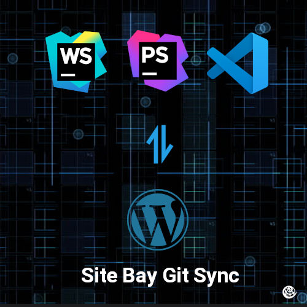

# Restoring your Git Sync Enabled Site

If you're running a modern WordPress stack, you're probably using our Bi-Directional Git Sync. But what happens when you need to roll back? Don't sweat it. Git Sync plays perfectly with our Point-in-Time (PIT) Machine, letting you restore your database and files down to the exact minute without breaking your repo history.

## How We Restore Your WordPress Files

When you trigger a restore using the PIT Machine from My SiteBay, we leverage the raw power of our Kubernetes infrastructure to seamlessly execute a **git revert** on your connected repository. 

Here is what's happening under the hood:
Instead of force-pushing or overwriting history (which is a nightmare for teams), the revert command creates a new commit containing the exact reverse patch of the changes you want to undo. History is preserved. If you realize the restore was a mistake, you can just use the PIT machine again to bounce right back to where you were before the restore. 

When you pick a time in the PIT Machine:
1. We locate the exact commit hash for that moment.
2. We revert the `HEAD` commit back to the state of the target commit hash. This walks back every change made since your restore point.
3. We generate a brand new commit that matches the old state and sync it to your environment. 

You get your site back to the way it was, without losing the paper trail.


Always use the Point-in-Time Machine in the SiteBay dashboard for restores. If you try to manually run git reverts locally and push them up, your database won't roll back with your files, leaving you with a mismatched content folder and database. Let our automated systems handle the heavy lifting.

