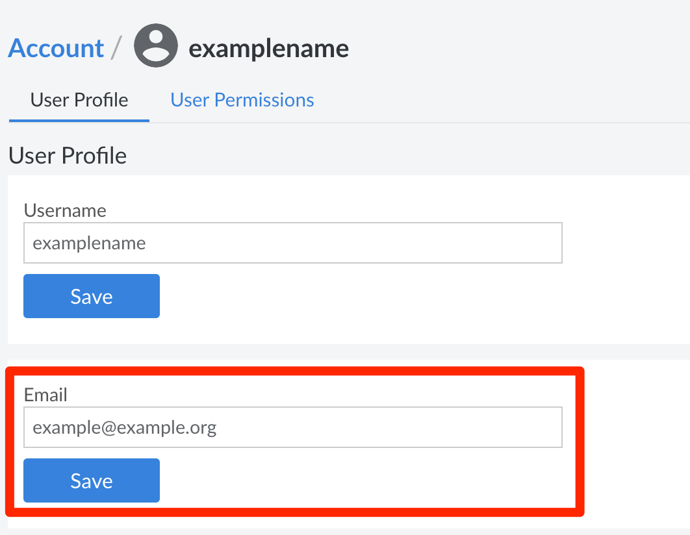

We use your email to send you important stuff—like billing receipts, Kubernetes cluster alerts, or heads-ups from the SiteBay MCP Server. Keep it updated so you don't miss anything critical.

You can set emails in two spots: **Billing Info** (for invoices) and **Users & Grants** (for account alerts). If it's just you, update both. If you've got a team, make sure the primary account holder's email is right on the billing page.

## Update Billing Email

Check out the [Update Billing Contact Information](/docs/products/platform/billing/guides/update-billing-contact-info/) guide for this one.

## Update User Account Email

Your user email gets the day-to-day stuff: password resets, support ticket replies, and access alerts.


Only users with full account access get the big threshold and billing notification emails.


To swap out a user's email:

1. Click **Account** in the sidebar.
2. Hit the **Users & Grants** tab.
3. Click the **User Profile** link for the user you want to update.
4. Drop the new email into the **Email** field.

    

5. Smash **Save**.

You're all set.


If you don't have full admin rights, you can still change your own email. Just click your username at the top of My SiteBay and select **Display** to tweak your profile.
