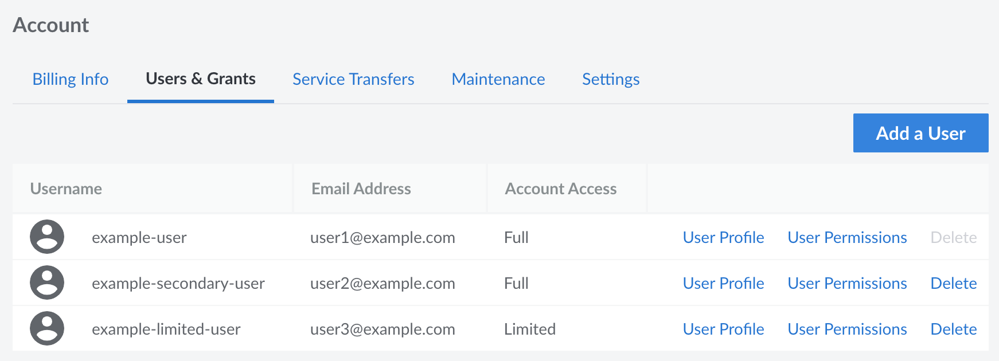

You can grant other people access to your My Site Bay account by creating *users* and assigning *permissions* to restrict access to certain areas of the control panel. Adding users and configuring permissions is useful for groups that need to grant all team members access to My Site Bay, or organizations that just want their billing department to have a separate account to receive invoices and billing information.


A single user was automatically created for your account when you signed up for Site Bay. If you are the only person accessing My Site Bay, you do not need to create any additional users on your account.


## View All Users

1. Log in to the [My Site Bay](https://my.sitebay.org) and select **Account** from the sidebar menu.

1. Navigate to the **Users & Grants** tab to display all users on the account. *Your user account must have full unrestricted access to view this page.*

Each user is listed in the table along with its username, email address, and the level of account access (*full* or *limited*).

## Add a User

To provide another person with access to your Site Bay account, you can create another user. Each user can be created with full unrestricted access or limited restricted access. For more details on user permissions, see [Set User Permissions](/docs/products/platform/accounts/guides/user-permissions/).

1. Navigate to the **Users & Grants** page in the My Site Bay. See [View All Users](#view-all-users).

1. Click the **Add a User** button to open the new user panel.

1. Enter the **Email** for the user.

1. Toggle the **Account Access** button to give the user full or limited access to account features.

1. Click **Submit**. The user will receive an email with instructions on creating a password and logging in to the account.

If you granted the user full access, the account is created and no further action is required. If you granted the user limited access, continue with [setting user permissions](/docs/products/platform/accounts/guides/user-permissions/).

In a couple minutes, you'll receive an email message with any My Site Bay users that correspond to that email. If you do not receive information about any users, then you may have registered your account with a different email.

## Remove a User

You can permanently remove a user account from My Site Bay. Here's how:

1. Navigate to the **Users & Grants** page in the My Site Bay. See [View All Users](#view-all-users).
1. Click the **Delete** link for the desired user. A warning appears asking you to confirm that you want to delete the user.
1. Click **Delete** in the warning to confirm deletion.

The user is removed and is no longer able to access My Site Bay.

## Change an Email

1. Please contact customer support to change your login email