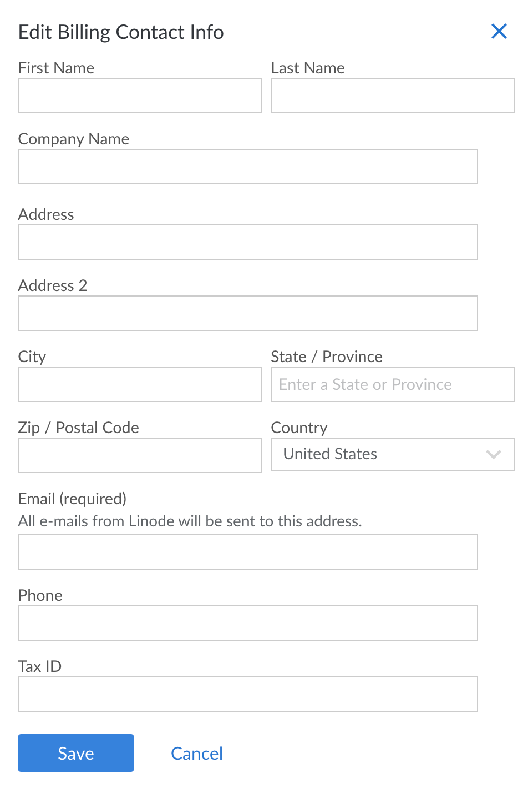

Need to update where your invoices go? You can do that right from the **Billing Info** page. The email address you drop in here is where we'll send your monthly bills, payment receipts, and heads-ups if your credit card is about to expire.


Keep in mind, normal support tickets (like questions about your Kubernetes cluster or the SiteBay MCP Server) go to your user email, not this billing contact.


## How to update it

1. Click **Account** in the sidebar.
2. Under the **Billing Contact** section, hit **Edit** to pull up the **Edit Billing Contact Info** menu.

    

3. Change whatever you need to—address, name, or the email address.
4. Hit **Save**.

Done. Your next invoice will use these updated details.