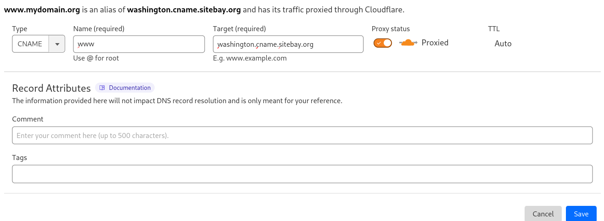
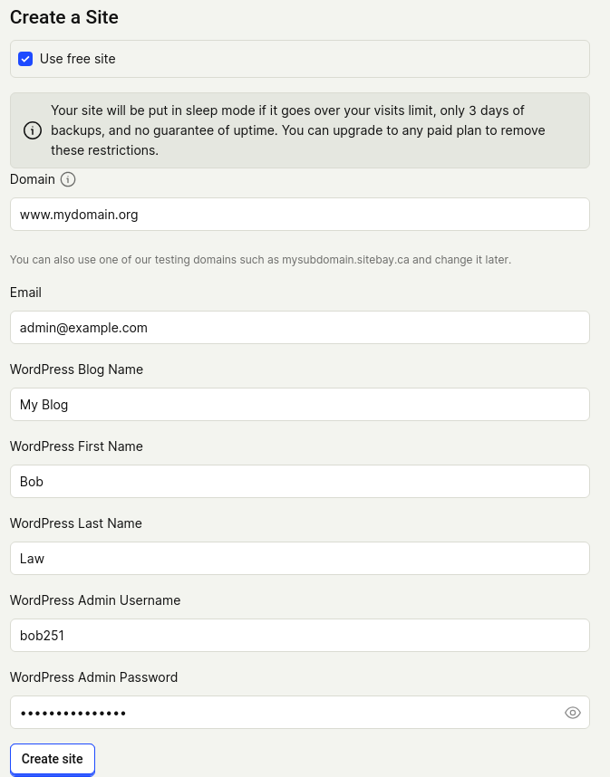

## Sign Up for an Account

First, you need to create a SiteBay account to start using our services. If you already have a SiteBay account, you can skip to the next section.

1.  Open a web browser and navigate to [my.sitebay.org/signup](https://my.sitebay.org/signup). If you are not already logged in to an account, the **Create an Account** form is displayed.

1.  Enter your email address and a strong password. Alternatively, you can sign up using your existing Apple, Google or GitHub/GitLab account. When using another provider, you are prompted for a username in a separate step.

    

1.  A confirmation email is sent to your email address shortly after. Click the link in that email to confirm your email address.

Testing things out? Use one of our test subdomains.

Launch Time: Name your site, set WordPress login details, and launch.

## Understand Billing

SiteBay services are billed to your primary payment method at your cycle reset date

- [Billing and Payments](/docs/products/platform/billing/)
- [Managing Billing in the My SiteBay](/docs/products/platform/billing/guides/)
- [SiteBay Pricing](https://www.sitebay.org/pricing/)

Keep in mind that charges will accrue for any active service, even if it is powered off or otherwise not in use. This includes WordPress Sites that have been powered off as well as any service you might have added to the account but are not using.

## Explore SiteBay Guides

SiteBay offers extensive documentation. This not only includes guides for WordPress and web services, but general guides.

- [SiteBay Docs](/docs/)