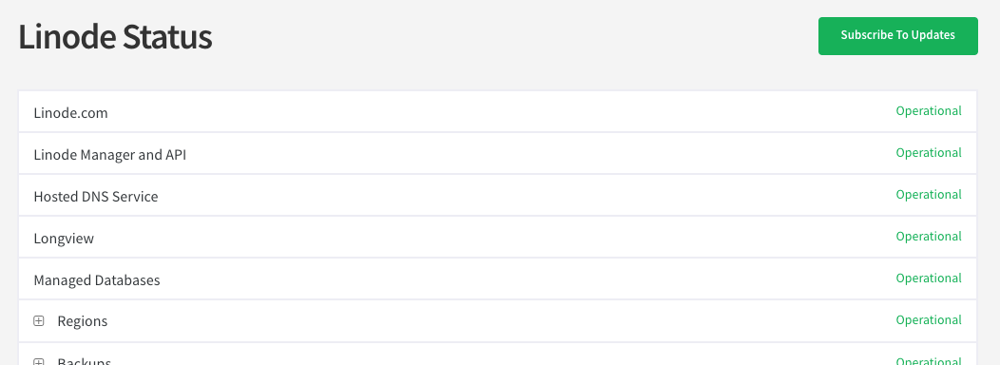

When things break or we're doing routine maintenance on our Kubernetes clusters, we post updates immediately to the [SiteBay Status Page](https://www.sitebay.org/status/). 

If you're relying on us for your AI-native WordPress hosting, you should definitely subscribe so you're never caught off-guard. You can even filter the updates so you only get pinged about the specific data centers you're actually using.

## Get Updates via Email or SMS

1. Go to the [SiteBay Status Page](https://www.sitebay.org/status/).
2. Hit the **Subscribe to Updates** button at the top.

    

3. Enter your email or phone number.
4. Pick which components (data centers or services) you care about, then click **Save**.
5. Check your inbox or phone for a confirmation message and verify it.

*(Note: If you ever want to stop getting text messages, just reply "STOP" to one of the alerts.)*

## Just Want the RSS Feed?

If you prefer using an RSS reader, or you want to pipe the updates into a Slack channel, use this URL: `https://www.sitebay.org/status/history.rss`.

## Track a Specific Incident

If there's currently an outage and you just want to know when it's fixed (without subscribing to everything forever):
1. Go to the status page and click on the specific incident.
2. Hit **Subscribe to Updates** right on that page.
3. Drop in your email or phone number.