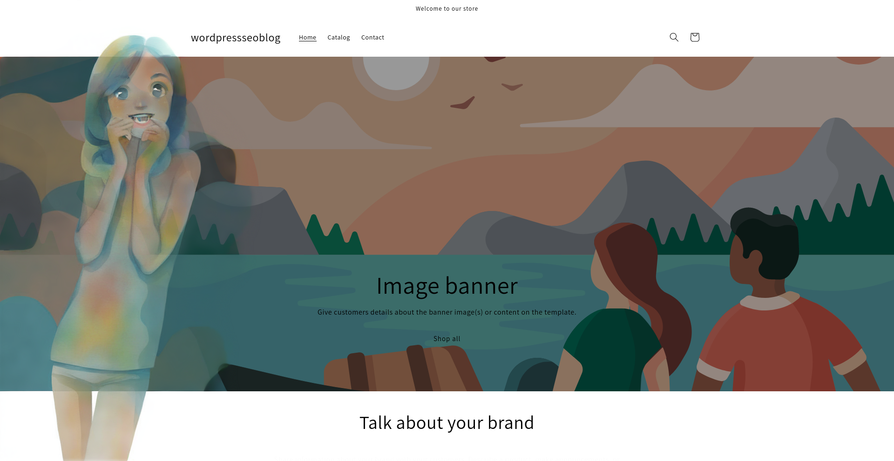

This guide will help you get started with installing and enabling the SiteBay Shopify Link, configuring your settings, and accessing your blog and PostHog features on SiteBay.

## Step 1: Install the SiteBay Shopify Link

The first step is to install the SiteBay Shopify Link on your Shopify store. Follow these steps to get it set up:

- Login to your Shopify Admin: Go to your Shopify store admin dashboard.
- Visit the App Store: Navigate to the Shopify App Store and search for "WordPress SEO Blog by SiteBay" or [click here](https://apps.shopify.com/wordpress-seo-blog).
- Install the App: Click on the "Add app" button to install the SiteBay Shopify Link on your store.
- Authorize the App: Follow the prompts to authorize the app to access your store's data.

## Step 2: Enable the Slider in Theme Settings

Once the SiteBay Shopify Link is installed, you need to enable it in your theme settings:

- Go to Online Store > Themes: In your Shopify admin, click on "Online Store" and then "Themes".
- Customize Your Theme: Find your current theme and click on "Customize".
- Open Theme Settings: In the theme editor, look for "Theme Settings" and click on it.
- Enable the SiteBay Slider: Find the slider option labeled "Enable SiteBay Shopify Link" and toggle it to "On" and click Save in the top right corner.

## Step 3: Enter Your Site URL on my.sitebay.org

To complete the setup, you need to configure your site URL on the SiteBay settings page:

- Visit SiteBay: Go to my.sitebay.org and log in to your account.
- Navigate to Settings: Click on "Settings" in the top menu.
- Enter Your Site URL: In the settings page, find the field labeled "Site URL" and enter the URL of your Shopify store.
- Save Changes: Click "Save" to update your settings.

## Step 4: Access Your Blog

After completing the setup, your blog will be available at /a/blog on your Shopify store. For example, if your store's URL is https://yourstore.myshopify.com, your blog will be accessible at https://yourstore.myshopify.com/a/blog.

## Step 5: View Recordings and Other PostHog Features

You can now access recordings and other PostHog features directly on SiteBay:

- Login to SiteBay: Go to my.sitebay.org and log in.
- Navigate to Your Dashboard: In your dashboard, you will find various analytics and features provided by PostHog.
- View Recordings: Click on the "Recordings" tab to view session recordings of your site visitors.
- Explore Other Features: Utilize other PostHog features like heatmaps, funnels, and user analytics to gain insights into your store's performance.

Congratulations! You've successfully set up the SiteBay Shopify Link and can now leverage its powerful features to enhance your Shopify store. If you have any questions or need further assistance, feel free to reach out to our support team.

## Q&A
- Can I have multiple shops?
- Yes, you can have multiple shops with multiple installs. They will automatically share the same resources as your base plan at no extra charge per shop.

- What happens if I go over my visits?
- Your sites will sleep, and you will no longer receive analytics data and your blog proxy will stop working.

- How can I upgrade?
- [In your team's plan settings](https://my.sitebay.org/settings/team) you can upgrade at any time if you go over your visits and reactivate your features.

- How can I uninstall the app or cancel my plan?
- In your Shopify Admin admin.shopify.com/store/YOURMYSHOPIFYDOMAIN/settings/apps/app_installations find our WordPress SEO Blog by SiteBay and click the dropdown menu (...) then click uninstall to stop future charges. Your non-free resources will be deleted at the end of your billing cycle.