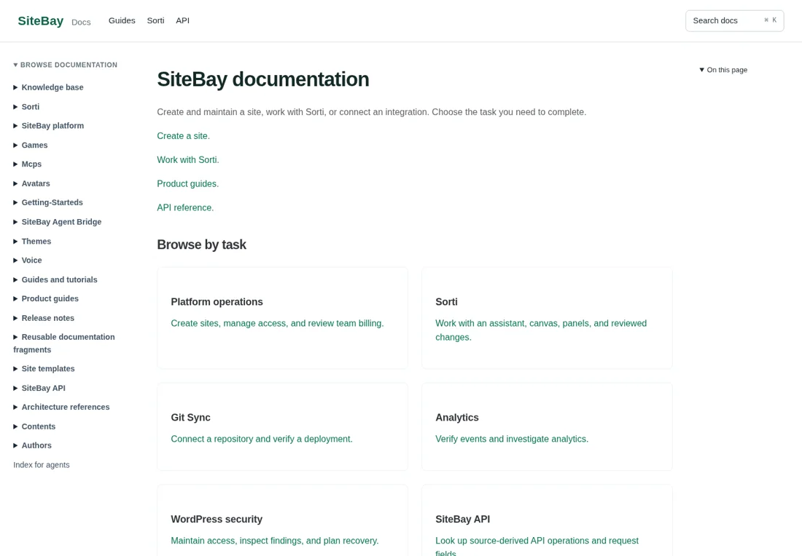
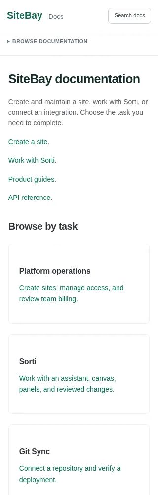

# Documentation search and knowledge reader

Verified October 8, 2026 in a clean clone of `b2ce0fcf6c3c9bb1364f40a56dd8ea3e5053d10c`.
The verification commit adds records and screenshots only; tested code tree:
`5ed646604597beb00321bbaeb2f96665b76a322c`.

## Delivered

The website uses local Pagefind search built with the same source corpus as the
read-only MCP reader. It has a consistent reading shell, keyboard search,
section filtering, and normal navigation without JavaScript. Active workflows
build an artifact; the old Algolia-writing release workflows are archived.

The reader exposes `search_docs`, `read_doc`, `list_docs`, and `docs_topics` over
stdio, standard Streamable HTTP, and Sorti's BYO-compatible endpoint. Results
carry source paths, revisions, original line ranges, hashes, and attribution.
Reference content does not grant permission to execute an operation. Source
identity and corpus integrity are validated before serving.

The PostgreSQL adapter supports lexical, exact vector, and hybrid retrieval.
Imports create immutable transactional snapshots. The serving role must be
read-only, and missing rows, changed hashes, or model/dimension mismatches fail
closed. A selected local embedding model is still needed for non-fixture
semantic relevance evaluation.

## Corpus

There are 356 maintained Markdown sources and
333 published SiteBay documents, with
1227 source-line chunks. The separate original
Linode library adds 2454 documents from
`fe2349568fa499a229a1a5e370929404d8e76287`: 2787
documents and 26448 chunks total. MCP Gateway,
pgvector, Haystack, and Ollama queries find the original upstream references.

The external library retains its source text, license, and provider identity.
It is not a rebranded article import and is not bundled into the public site.
SiteBay is the default search namespace; external references are explicitly
selected. Task and system maps lead Sorti from a requested operation to its
procedure, implementation, and verification checks.

## Verification

| Check | Result |
| --- | --- |
| Root and reader clean npm installs | Passed |
| Hugo and Pagefind build | 617 generated pages; 333 search documents |
| Article review, editorial, spelling | Zero findings across 356 sources |
| Published internal links and fragments | 1536 checked; zero issues |
| Python tests | 37 passed |
| Node publishing tests | 4 passed |
| Knowledge service and provenance tests | 11 passed |
| Real PostgreSQL 17 / pgvector | 13 integration assertions passed |
| Actual Sorti BYO client | Discovery, roster, cited reads, resources, and rejected writes passed |
| Curated SiteBay lexical retrieval | 13/13 cases passed |
| Combined original-library retrieval | 17/17 cases passed |
| Browser page coverage | 333/333 routes |
| Responsive layouts | 18 cases at 320px and 1440px |
| Browser runtime and missing local assets | Zero errors |
| Search behavior | Real index queries/clicks, keyboard, filtering, cancelled-query reopen passed |
| No-JavaScript reading | Passed |
| API, Forge, and knowledge generation | Match their reviewed sources |

The previous interrupted browser run remains in local evidence. The final run
used a dedicated temporary directory and completed all three route shards.
No failed case was skipped or converted into an allowance.

## Captured interface

## Use and release boundary

See `knowledge/README.md` for local CLI, MCP client configuration, and the
explicit database importer. `ci/README.md` reproduces the checks. Local generated
artifacts are available in the working checkout; they are not a website release.
The reader was tested against Sorti's actual client without changing its source
or attaching to a live session. No production deployment, customer database,
Algolia index, or remote embedding service was changed. Main remains on the
requested rollback pending an explicit release decision.
